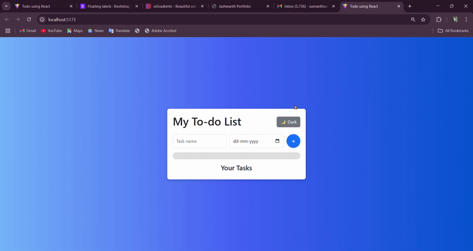

# 📝 React To-Do List App

A fully functional, modern, and responsive To-Do List app built with **React + Vite**.

🔗 **Live Demo**: [todo-react-app-sumanth.vercel.app](https://todo-react-app-sumanth.vercel.app)  
[](https://vercel.com/import/project?template=todo-react-app)

---

## 🚀 Features

- ✅ Add, edit, delete tasks
- 📅 Set due dates for each task
- 🔁 Mark tasks as complete or undo
- 🧠 Inline editing for task name and due date
- 📊 Progress bar showing % of tasks completed
- 💾 LocalStorage persistence
- 🌙 Dark mode toggle
- 🎬 Slide-in animations
- 📱 Fully responsive (mobile-friendly)

---

## 🧩 Live Preview

> 🖼 Add a file named `preview.gif` in your project root  
> Here's how it will appear:



---

## 📦 Tech Stack

- ⚛️ React + Vite
- 🎨 CSS3 + Bootstrap
- 🗂️ LocalStorage
- 🚀 Deployed via [Vercel](https://vercel.com)

---

## 🔧 Local Setup

```bash
# Clone the repo
git clone https://github.com/mrsumanth19/todo-react-app.git
cd todo-react-app

# Install dependencies
npm install

# Start development server
npm run dev

# Visit http://localhost:5173
````

---

## 🧪 Deployment

Deployed on **Vercel** at:
🌍 [https://todo-react-app-sumanth.vercel.app](https://todo-react-app-sumanth.vercel.app)

---

## 📄 License

This project is open-source and available under the [MIT License](LICENSE).

---

## 🔗 Connect with Me

Made with ❤️ by [Sumanth Vanapalli](https://github.com/mrsumanth19)

* 🌐 Portfolio: [sumanthvanapalli.netlify.app](https://sumanthvanapalli.netlify.app)
* 💼 LinkedIn: [linkedin.com/in/sumanth-vanapalli](https://www.linkedin.com/in/sumanth-vanapalli)
* 📧 Email: [sumanthvanapalli194@gmail.com](mailto:sumanthvanapalli194@gmail.com)


